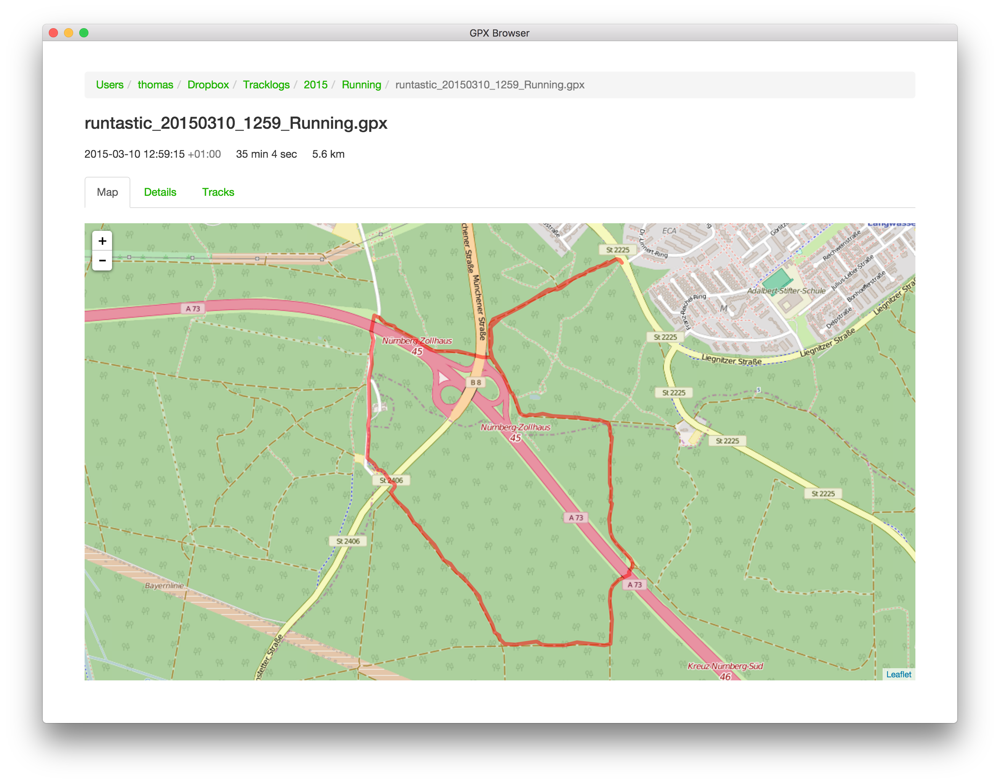

# GPX Browser

GPX Browser is a desktop application for browsing GPX files.

GPX Browser is built using web technologies and powered by
[Electron](http://electron.atom.io/) and [React](https://facebook.github.io/react/).
Parsing the GPX files is not done in JavaScript, but outsourced to
[gpxtojson](https://github.com/thcyron/gpxtojson), which must be in your `$PATH`.

GPX Browser is still in development and only basic features have been implemented.

## Screenshot

## Building and running GPX Browser

In the project’s root directory, run:

    npm install
    npm run build
    npm run start

Make sure `gpxtojson` is installed.

## License

GPX Browser is licensed under the MIT license.
